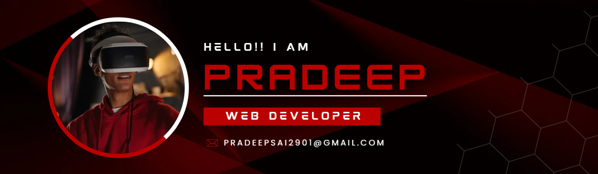

# 💫 About Me:

  🎓I'm a 3rd Year CSE student specializing in AIML and Full Stack Development. 
  🧑‍💻I'm passionate about building scalable web applications with the MERN stack. 
  ⚙️Ask me about anything #React #Nodejs #web #design 
  🏆Contributing to @VistasCodingClub as a Student Coordinator

## 🌐 Socials:

&nbsp;&nbsp;&nbsp;&nbsp;

# 💻 Tech Stack:

  
  

# 📊 Github Stats:

### ✍️ Random Dev Quote

